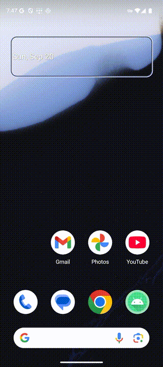

# Android Use

**Computer-use for Android.** An [MCP](https://modelcontextprotocol.io) server
that lets Claude *see and operate a real Android phone* — read the screen, tap,
type, scroll, navigate settings, launch apps — from anywhere, over cellular. No
root, no per-app API. Just the phone, driven the way a person drives it.

Think of it as the mobile counterpart to computer-use: instead of pixels and
blind coordinate-guessing, it reads the phone's **accessibility tree** and hands
the model a numbered list of what's actually on screen. The model acts by index.



```
App: com.android.deskclock
  [0] More settings <Button> @975,437
  [1] 7:00 AM / gym / Mon,Tue,Wed,Thu,Fri,Sat <item> [ON]  @540,835
  [2] 10:00 AM / pick up parcel / Today       <item> [OFF] @540,1101
```

*"Turn off my gym alarm"* becomes `tap(1)` — precise, cheap, and it survives
layout shifts that break coordinate-based control.

Built for the people who find phones hard: an older relative in another city,
anyone who doesn't know where a setting lives. *"Why isn't my internet working?"*
→ Claude diagnoses it and fixes it, over their mobile data, while they watch.

> ⚠️ This is a **remote phone-control tool**. Read [SECURITY.md](SECURITY.md)
> before you run it. Conservative defaults are on for a reason; don't strip them.

## Why it's different

- **Accessibility tree, not screenshots.** Real, labelled, tappable targets —
  far more reliable than asking a model to guess pixels. Screenshots are there
  as a fallback for videos, games, and canvas-drawn UIs.
- **The hard part, handled:** Android splits a row across nodes — the tappable
  container carries no label, the label isn't tappable. Android Use folds each
  label into its nearest clickable ancestor, so one screen row = one entry.
- **Works from anywhere.** Cellular + [Tailscale](https://tailscale.com) means
  the phone needs no Wi-Fi and no cable — the case that actually matters when
  you're helping someone in another city.
- **Swappable transport.** Every tool talks to one `Backend` interface. ADB
  (USB/Wi-Fi) today; an on-device companion app for the fully-remote, no-dev-
  options path. The 30+ tools never change when the transport does.
- **Types any language.** The companion app uses `ACTION_SET_TEXT`, so Telugu,
  Hindi, emoji all work — `adb shell input text` can't do that.

## How it works

```
Claude (Code / Desktop / claude.ai / mobile)
    │  MCP
    ▼
Android Use server  ──►  Backend interface
    │                      ├── AdbBackend      (USB or Wi-Fi, via adb)
    │                      └── AppBackend       (on-device app + HTTP bridge)
    ▼
your phone  ── accessibility service reads the screen, dispatches taps/gestures
```

Two ways to reach the phone:

1. **ADB** — quickest to try. Plug in (or pair wirelessly), and it works.
2. **Companion app** — a small Android app with an AccessibilityService and a
   token-authenticated bridge. No dev options, survives reboot, reaches the
   phone over Tailscale from anywhere, and can repair its own service remotely.

## Quick start (ADB, 2 minutes)

```bash
git clone https://github.com/bsaisuryacharan/android-use && cd android-use
uv venv && uv pip install -e .

# phone: Settings → About → tap Build number ×7 → Developer options → USB debugging
adb devices          # should list your phone

# register with Claude Code
claude mcp add -s user android-use -- "$PWD/.venv/bin/python" -m android_use.server
```

Restart Claude Code, then just talk: *"what's on my phone screen?"*,
*"turn off my 7am alarm"*, *"open YouTube and search for lo-fi"*.

For the fully-remote path (companion app + Tailscale + claude.ai connector), see
[SETUP_APP.md](SETUP_APP.md), [CONNECTOR.md](CONNECTOR.md), and
[MULTI_DEVICE.md](MULTI_DEVICE.md).

## Tools (30+)

| | |
|---|---|
| `get_screen` / `take_screenshot` | Read the screen as a numbered list, or as an image |
| `tap` / `tap_text` / `tap_coordinates` | Act by index, label, or pixel |
| `scroll` / `type_text` / `press_key` | Navigate, type, hardware keys |
| `open_app` / `list_apps` | Launch apps (allowlist-enforced) |
| `open_settings` | Jump straight to a Settings page (wifi, battery, …) |
| `check_internet` | Diagnose connectivity without touching the screen |
| `list_phones` / `add_phone` / `lock_phone` | Drive several phones, named, isolated |
| `repair_phone` | Re-enable the accessibility service remotely |
| `chrome_*` | Drive Chrome via the DevTools protocol — real DOM, any language |

Multiple phones are named and never confused; every result says which phone it
touched, and you can hard-**lock** to one.

## Honest limitations

- **Setup is the hard part**, especially the companion app on Android 13+
  ("restricted settings" blocks sideloaded accessibility apps until you allow it
  via App info → ⋮). This is the real barrier for non-technical users.
- **A PIN/pattern lock can't be bypassed** — the owner unlocks the phone.
- **Secure screens block reads** — banking apps often set `FLAG_SECURE`.
- **Tokens are plaintext and rotate on reinstall.** Pairing UX is rough.
- **Google restricts accessibility apps** on the Play Store; distribution is a
  real consideration, not a formality.

See [SECURITY.md](SECURITY.md) for the threat model and responsible-use policy.

## Status

Working prototype. Verified end-to-end on vivo (Funtouch/Android 15) and a
Pixel 9 emulator (Android 16), driven from Claude Code, Claude Desktop, and
claude.ai over cellular. Contributions welcome — especially OEM compatibility,
onboarding UX, and the security items in SECURITY.md.

## License

[Apache 2.0](LICENSE).
